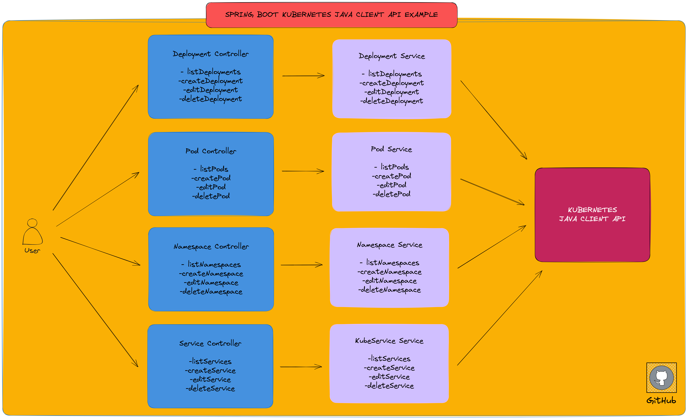
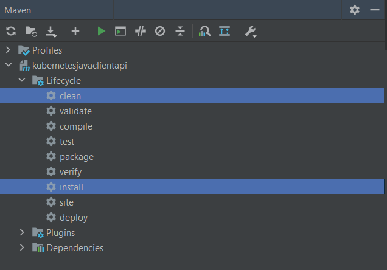
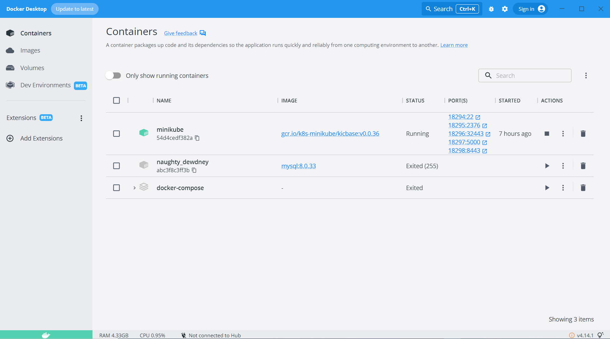
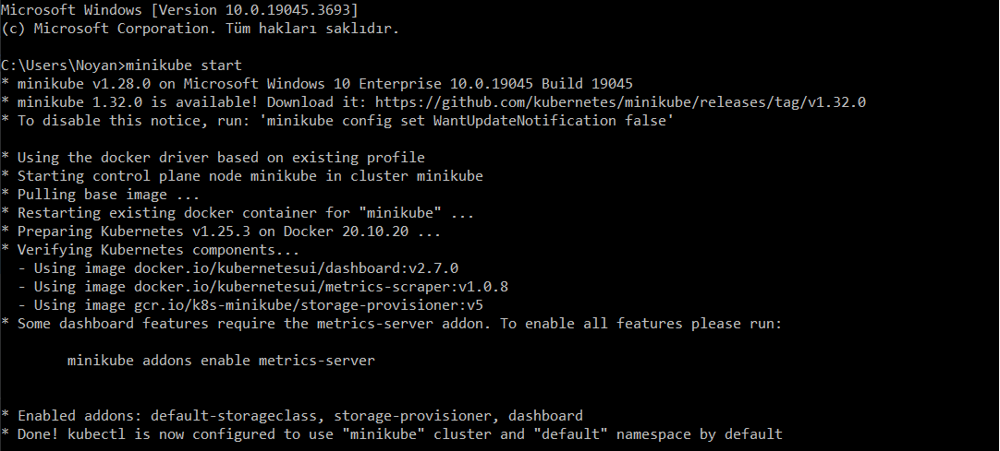

# Spring Boot Kubernetes Java Client Client Example

<p align="center">
    
</p>

### 📖 Information

<ul style="list-style-type:disc">
  <li>This <b>Spring Boot</b> application showcases the integration of the <b>Kubernetes Java Client API</b> to manage Kubernetes resources efficiently.</li> 
  <li>The implemented features cover the processes of <b>listing</b>, <b>creating</b>, <b>editing</b>, and <b>deleting</b> the following <b>Kubernetes</b> resources:</li>
  <ul>
    <li>Namespace</li>
    <li>Pod</li>
    <li>Service</li>
    <li>Deployment</li>
  </ul>
</ul>

### Explore Rest APIs

<table style="width:100%">
  <tr>
      <th>Method</th>
      <th>Url</th>
      <th>Description</th>
      <th>Request Body</th>
      <th>Header</th>
      <th>Valid Path Variable</th>
      <th>No Path Variable</th>
  </tr>
  <tr>
      <td>GET</td>
      <td>/api/v1/kubernetes/deployments/listDeployments</td>
      <td>List Deployments</td>
      <td></td>
      <td></td>
      <td></td>
      <td></td>
  <tr>
  <tr>
      <td>POST</td>
      <td>/api/v1/kubernetes/deployments/createDeployment</td>
      <td>Create Deployment</td>
      <td>CreateDeploymentRequest</td>
      <td></td>
      <td></td>
      <td></td>
  <tr>
  <tr>
      <td>PUT</td>
      <td>/api/v1/kubernetes/deployments/editDeployment</td>
      <td>Edit Deployment</td>
      <td>EditDeploymentRequest</td>
      <td></td>
      <td></td>
      <td></td>
  <tr>
  <tr>
      <td>DELETE</td>
      <td>/api/v1/kubernetes/deployments/deleteDeployment</td>
      <td>Delete Deployment</td>
      <td>DeleteDeploymentRequest</td>
      <td></td>
      <td></td>
      <td></td>
  <tr>
  <tr>
      <td>GET</td>
      <td>/api/v1/kubernetes/namespaces/listNamespaces</td>
      <td>List Namespaces</td>
      <td></td>
      <td></td>
      <td></td>
      <td></td>
  <tr>
  <tr>
      <td>POST</td>
      <td>/api/v1/kubernetes/namespaces/createNamespace</td>
      <td>Create Namespace</td>
      <td>CreateNamespaceRequest</td>
      <td></td>
      <td></td>
      <td></td>
  <tr>
  <tr>
      <td>PUT</td>
      <td>/api/v1/kubernetes/namespaces/editNamespace</td>
      <td>Edit Namespace</td>
      <td>EditNamespaceRequest</td>
      <td></td>
      <td></td>
      <td></td>
  <tr>
  <tr>
      <td>DELETE</td>
      <td>/api/v1/kubernetes/namespaces/deleteNamespace</td>
      <td>Delete Namespace</td>
      <td>DeleteNamespaceRequest</td>
      <td></td>
      <td></td>
      <td></td>
  <tr>
  <tr>
      <td>GET</td>
      <td>/api/v1/kubernetes/pods/listPods</td>
      <td>List Pods</td>
      <td></td>
      <td></td>
      <td></td>
      <td></td>
  <tr>
  <tr>
      <td>POST</td>
      <td>/api/v1/kubernetes/pods/createPod</td>
      <td>Create Pod</td>
      <td>CreatePodRequest</td>
      <td></td>
      <td></td>
      <td></td>
  <tr>
  <tr>
      <td>PUT</td>
      <td>/api/v1/kubernetes/pods/editPod</td>
      <td>Edit Pod</td>
      <td>EditPodRequest</td>
      <td></td>
      <td></td>
      <td></td>
  <tr>
  <tr>
      <td>DELETE</td>
      <td>/api/v1/kubernetes/pods/deletePod</td>
      <td>Delete Pod</td>
      <td>DeletePodRequest</td>
      <td></td>
      <td></td>
      <td></td>
  <tr>
  <tr>
      <td>GET</td>
      <td>/api/v1/kubernetes/services/listServices</td>
      <td>List Services</td>
      <td></td>
      <td></td>
      <td></td>
      <td></td>
  <tr>
  <tr>
      <td>POST</td>
      <td>/api/v1/kubernetes/services/createService</td>
      <td>Create Service</td>
      <td>CreateServiceRequest</td>
      <td></td>
      <td></td>
      <td></td>
  <tr>
  <tr>
      <td>PUT</td>
      <td>/api/v1/kubernetes/services/editService</td>
      <td>Edit Service</td>
      <td>EditServiceRequest</td>
      <td></td>
      <td></td>
      <td></td>
  <tr>
  <tr>
      <td>DELETE</td>
      <td>/api/v1/kubernetes/services/deleteService</td>
      <td>Delete Service</td>
      <td>DeleteServiceRequest</td>
      <td></td>
      <td></td>
      <td></td>
  <tr>
</table>


### Technologies

---
- Java 17
- Spring Boot 3.0
- Restful API
- Lombok
- Maven
- Junit5
- Mockito
- Integration Tests
- Postman

### Prerequisites to Run the App 

<b>1 )</b> Install <b>minikube</b> to access this link https://minikube.sigs.k8s.io/docs/start/

<b>2 )</b> Open <b>command prompt</b> and install <b>kubectl</b> through this command shown below
```
    minikube kubectl --
```

<b>3 )</b> Start <b>minikube</b> through this command shown below.
```
    minikube start
```

### Maven Run
To build and run the application with `Maven`, please follow the directions shown below;

```sh
$ cd kubernetesjavaclientapi
$ mvn clean install
$ mvn spring-boot:run
```

### Screenshots

<details>
<summary>Click here to show the screenshots of project</summary>
    <p> Figure 1 </p>
    
    <p> Figure 2 </p>
    
    <p> Figure 3 </p>
    
</details>

### Contributors

- [Sercan Noyan Germiyanoğlu](https://github.com/Rapter1990)